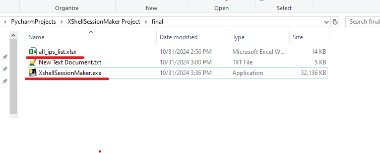

# **Welcome to the Xshell Session Make page that... blah blah blah .. **  
Being a Network Engineer, I can tell you—no matter what fancy title you’ve got, setting up SSH sessions is always a pain in the A**. Especially when you’re switching laptops, changing jobs, or just trying to remember which device is which! But don’t worry, this tool’s got you covered. Just drop your device IPs into an Excel file, make sure your credentials work, and BAM! Instant Xshell sessions, no hassle. 

(And yeah, I totally used ChatGPT to polish these lines because, just like my job, my English is aslo shi.. well, let’s just say it needed a firm smack on the back) why the hell are you still reading sll this , read the guidelines and go fix your crappy job!  

**1 -:** Make an Xshell session that is working fine , save the username and password for the session.  
 
 
 
 
**2 -:** Open the Xshell session file in Notepad, **copy its content**, and **save it as a .txt** file in the same folder as **XshellSessionMaker.exe** 
 **Warrning !!!** don't just change the extension, you have to make a new text file and copy paste the contents from xsh file
 
 
 
 

**3 -:** Copy your excel device list (**.xlsx file with any name**) in same folder where the **XshellSessionMaker.exe** is saved 
 
 
 
 
 
**4 -:** Your device list **must have** an '**IP**' column header, under which all the device IPs are mentioned,order of columns does not matter as long as there is an IP column 
**5 -:** Device list can **optionally** have '**Hostname**'  and '**City**' columns as well to store sessions in relevant city folders  
 
 
 
 
 
**6 -:** **Run the XshellSessionMaker.exe** (as admin if available), the output session files will be stored in **Sessions_files** folders 
 
 
 
 
I mean whats the point of having a public github repo if i'm not receiving  , Go ahead:  Drop your creative susidal ideas at **khwajahaseeb@yahoo.com**  
